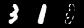

[TensorFlow] A disentangled generative model for disease decomposition in chest X-rays via normal image synthesis
=====

TensorFlow implementation of Disentangled Generative Model (DGM) with MNIST dataset.  

## Architecture

### Losses

### DGM architecture

    
  
The architecture of DGM [1].

### Graph in TensorBoard

    
  
Graph of DGM.

### Problem Definition

    
  
'Class-1' is defined as normal and the others are defined as abnormal.

## Results

### Training Procedure

  

    
    
    
  

  
Losses for training generative components. Each graph shows adversarial loss, reconstruction loss, and total variation loss sequentially.

  

    
    
  

  
Loss graphs in the training procedure. Each graph shows generative loss and discriminative loss respectively.

    
  
Restoration result by DGM.

### Test Procedure

  
  
Box plot with encoding loss of test procedure.

  

    
    
    
  

  
Normal samples classified as normal.

  

    
    
    
  

  
Abnormal samples classified as normal.

  

    
    
    
  

  
Normal samples classified as abnormal.

  

    
    
    
  

  
Abnormal samples classified as abnormal.

## Environment
* Python 3.7.4  
* Tensorflow 1.14.0  
* Numpy 1.17.1  
* Matplotlib 3.1.1  
* Scikit Learn (sklearn) 0.21.3  

## Reference
[1] Youbao Tang et al. (2021). <a href="https://www.sciencedirect.com/science/article/pii/S1361841520302036?dgcid=rss_sd_all">A disentangled generative model for disease decomposition in chest X-rays via normal image synthesis</a>. Medical Image Analysis. ELSEVIER.  
